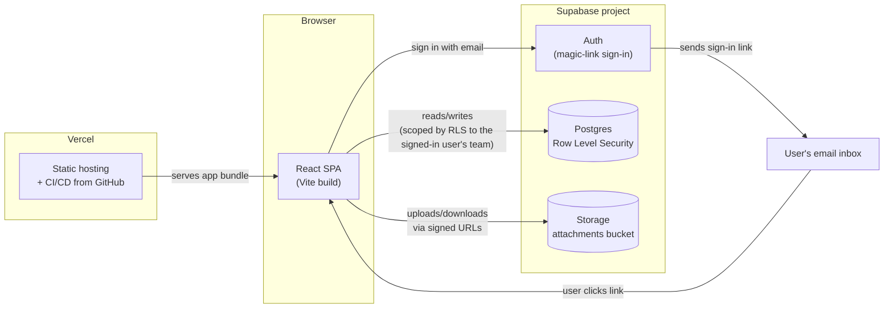

# IEP Progress Tracker

Live app: https://my-school-progress-tracker.vercel.app

## About

A child's IEP (Individualized Education Program) progress lives in a lot of different
places: a teacher's notes, a therapist's session summary, a parent's observation at
home, an annual re-evaluation report. None of it is normally in one place, and none of
it is normally visible to everyone who's actually involved in the child's care.

This app is a small web tool that puts all of that in one shared, living
record: how the child is doing in each developmental area, what their IEP goals are and
how close they are to meeting them, and a running timeline of dated updates — each one
tagged with who logged it (parent, teacher, or formal assessment) and, optionally,
a supporting document or photo.

## Why it helps

- **One shared source of truth.** Parents, teachers, and outside providers (therapists,
  tutors) are often each tracking pieces of the same child's progress separately. This
  gives everyone the same up-to-date picture instead of fragmented notes and emails.
- **Progress over time, not just a snapshot.** The Timeline and per-domain history turn
  scattered observations into a chronological record, useful when preparing for an IEP
  meeting or an annual re-evaluation.
- **Context on *why* a level changed.** Every update carries a note and an optional
  attachment (e.g. an assessment report), not just a number — so a progress bar moving
  is always backed by the observation that explains it.
- **Access you control.** The child's family decides exactly who's on the team and
  what they can see (full progress, or academic-only), and can revoke access at any
  time from the Profile screen.

## Architecture



**How it fits together:**

- The **React SPA** is a static build with no backend server of its own — it talks
  directly to Supabase from the browser.
- **Auth** is passwordless: a user enters their email, gets a one-time sign-in link,
  and clicking it establishes their session — no passwords to manage.
- **Postgres + Row Level Security** is the only data store. Every table's access is
  scoped through a `team_members` row, so a signed-in user can only read or write data
  for a child they've actually been added to the team of — enforced by the database
  itself, not just the app's UI.
- **Storage** holds uploaded photos/documents for timeline entries, in a private
  bucket accessed via short-lived signed URLs rather than public links.
- **Vercel** builds and serves the static app on every push to `master`.

## Screens

- **Home** — progress-by-domain overview, IEP goals summary, recent updates
- **Timeline** — full log of updates, filterable by domain, grouped by month
- **Goals** — all IEP goals with progress and status
- **Profile** — child info, IEP status, and the team of people with access
- **Domain Detail** — per-skill breakdown, goals, and history for one domain
- **Log an Update** — record a note from a parent, teacher, or assessment, with an
  optional photo/document attachment
- **Invite to Team** — add a family member, school staff, or outside provider

## Tech stack

- [React](https://react.dev/) + [TypeScript](https://www.typescriptlang.org/) +
  [Vite](https://vitejs.dev/)
- [React Router](https://reactrouter.com/) for navigation
- [Supabase](https://supabase.com/) — Postgres database, Row Level Security,
  magic-link auth, and file storage
- [Vitest](https://vitest.dev/) for unit tests
- Deployed on [Vercel](https://vercel.com/)

## Getting started

### Prerequisites

- Node.js 18+
- A Supabase project

### Setup

1. Install dependencies:

   ```bash
   npm install
   ```

2. Copy the env template and fill in your Supabase project's URL and anon key
   (Project Settings → API in the Supabase dashboard):

   ```bash
   cp .env.local.example .env.local
   ```

3. Set up the database — in the Supabase SQL Editor, run:

   ```sql
   create extension if not exists pgcrypto;
   ```

   then run the full contents of
   [`supabase/migrations/0001_init.sql`](supabase/migrations/0001_init.sql). This
   creates the schema, Row Level Security policies, and seeds one profile with sample
   data.

4. Enable magic-link auth — in the dashboard, confirm **Authentication → Providers →
   Email** is enabled, and set **Authentication → URL Configuration → Site URL** to
   your local or deployed URL.

5. Create a private Storage bucket named `attachments`, then grant the `authenticated`
   role read/write access:

   ```sql
   create policy "authenticated can read attachments"
   on storage.objects for select
   to authenticated
   using (bucket_id = 'attachments');

   create policy "authenticated can upload attachments"
   on storage.objects for insert
   to authenticated
   with check (bucket_id = 'attachments');
   ```

6. Start the dev server:

   ```bash
   npm run dev
   ```

## Scripts

| Command | Description |
| --- | --- |
| `npm run dev` | Start the Vite dev server |
| `npm run build` | Type-check and build for production |
| `npm run preview` | Preview the production build locally |
| `npm test` | Run the test suite once |
| `npm run test:watch` | Run tests in watch mode |

## Project structure

```
src/
  auth/         magic-link auth context, sign-in screen, route guard
  components/   shared UI (progress bar, tag, tab bar, floating action button)
  data/         Supabase queries, one module per resource (domains, goals, timeline, team)
  lib/          pure logic — types, level/status thresholds, date formatting, attachments
  screens/      one component per screen, matching the routes in App.tsx
  styles/       design tokens and app-shell layout CSS
supabase/
  migrations/   SQL schema, Row Level Security policies, and seed data
```

## Deployment

The app deploys to Vercel from the `master` branch. Set `VITE_SUPABASE_URL` and
`VITE_SUPABASE_ANON_KEY` as environment variables in the Vercel project, and add the
deployed URL to Supabase's **Authentication → URL Configuration** so magic-link sign-in
redirects correctly in production.
